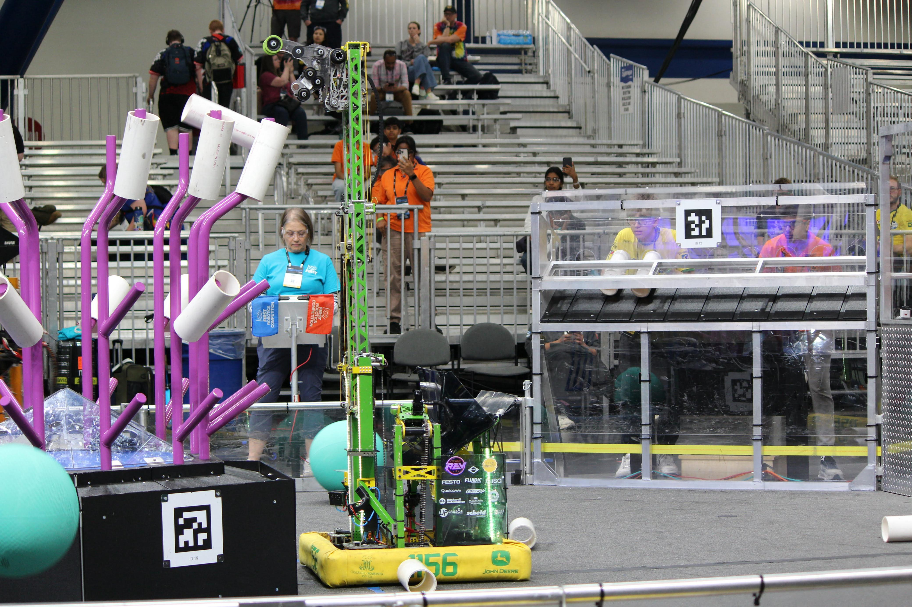

# Ultralisk 2025
Code for the Ultralisk 2025 Reefscape robot.

## Highlights

- Controls

    Ultralisk uses a control board that merges driver and operator inputs into a single interface. The driver handles movement and scoring triggers while the operator controller provides overrides and fine control when needed.

- Vision

    Dual Limelight cameras provide AprilTag detection and pose estimation. The reef pose estimator filters desired tags based on target branches and fuses vision with odometry for alignment. Details are in [our pose estimator](/src/main/java/frc/robot/pose_estimators/ReefPoseEstimatorWithLimelight.java).

  Snapshot Branches

    You can see how the robot code was **before** and **after** each competition that Ultralisk participated.

## Packages

- [`frc.robot.subsystems`](/src/main/java/frc/robot/subsystems/)

  Implements the climber, LED patterns, scoring mechanisms, and swerve drive modules.

- [`frc.robot.pose_estimators`](/src/main/java/frc/robot/pose_estimators/)

  Provides pose estimation utilities that integrate vision and odometry.

- [`frc.robot.joysticks`](/src/main/java/frc/robot/joysticks/)

  Houses driver and operator controller abstractions and the main control board mapping.

- [`frc.robot.commands.autonomous_commands`](/src/main/java/frc/robot/commands/autonomous_commands/)

  Contains autonomous routines for scoring coral, removing algae, and positioning around the reef.

- [`frc.robot.commands.swerve`](/src/main/java/frc/robot/commands/swerve/)

  Holds drive-related commands used for auto-aligning and autonomous scoring.

---
